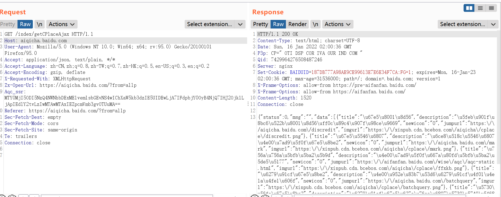
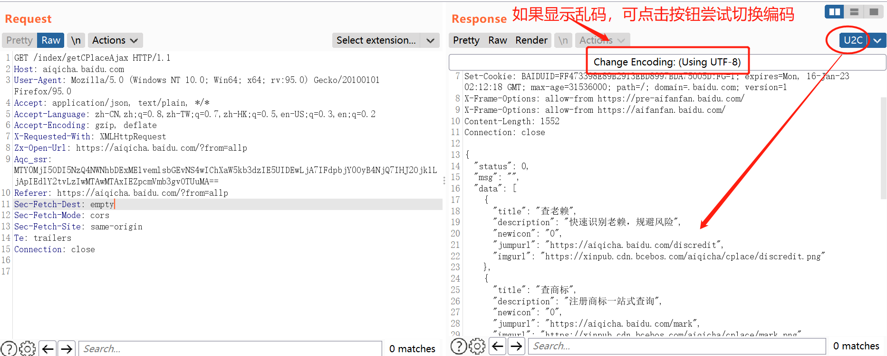

###################################################

# 该项目不再维护，功能已经合并到[knife](https://github.com/bit4woo/knife) 

#########################################################

## U2C  = Unicode To Chinese

A burpsuite Extender That Convert Unicode To Chinese

Unicode 转中文 的burp suite插件

GitHub: https://github.com/bit4woo/u2c

Download: https://github.com/bit4woo/u2c/releases

### version 0.1-0.5

前五个版本使用自定义的图形界面，是在原始请求响应的基础上修改数据包，然后进行展示。

这样有个坏处就是可能破坏响应包在浏览器等终端的展示，可能出现乱码。虽然设计了图像界面进行控制，但是也不够灵活简洁。

前五个版本算是走了冤枉路，但也是由于有前五个版本，才有了下面的第六版。

### version 0.6

完全重写，使用新的tab来展示转码后的响应数据包，不影响原始的响应数据包，更加简洁实用！

值得注意的是：U2C中的显示情况与burp中User options---Display--- HTTP Message Display & Character Sets有关，目前burp的API无法完全控制。只能自行设置。

### version 0.9

将【Unicode转中文】+【切换中文显示的编码】融合。

### Unicode测试URL

https://passport.baidu.com/v2/api/getqrcode

https://aiqicha.baidu.com/index/getCPlaceAjax